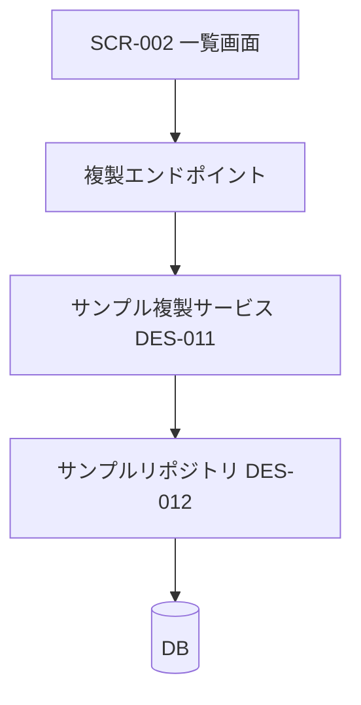
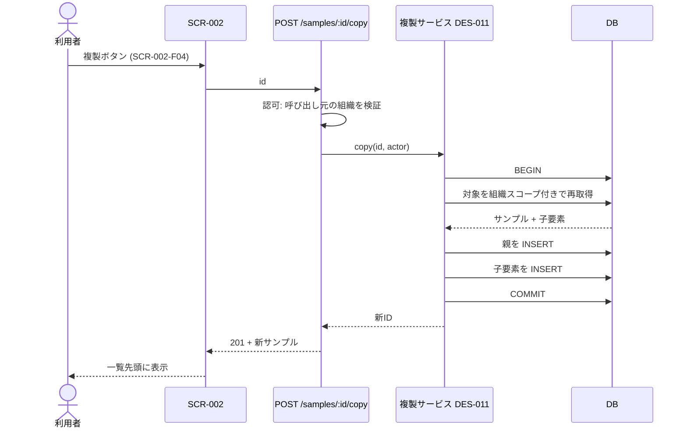
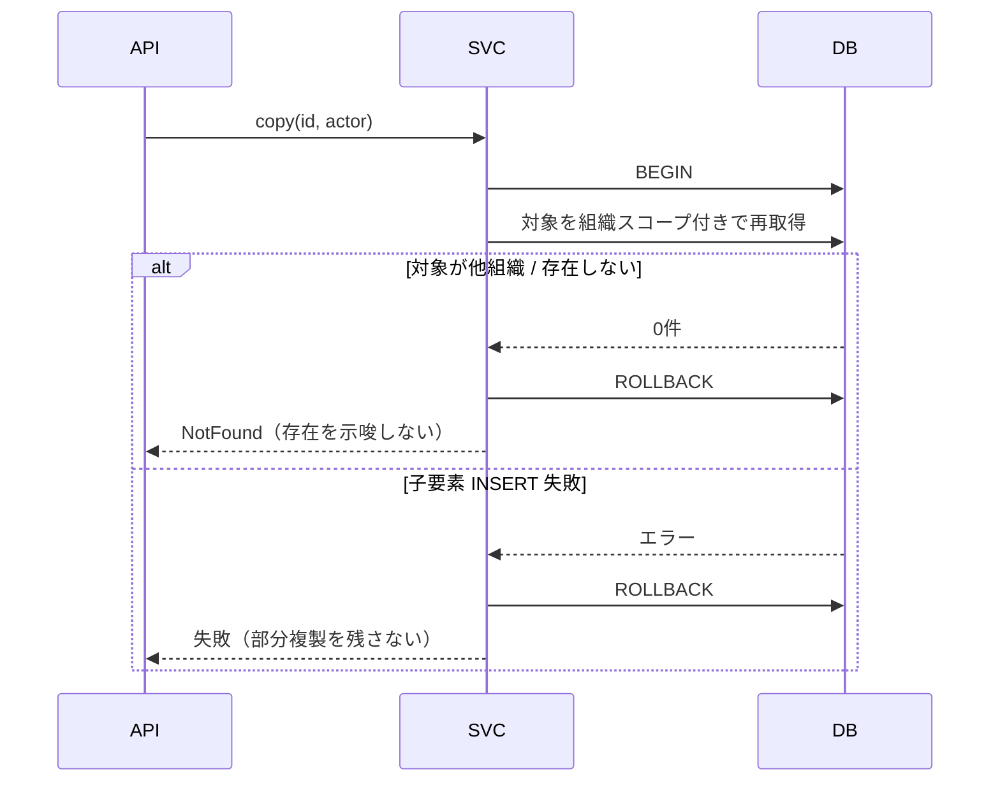
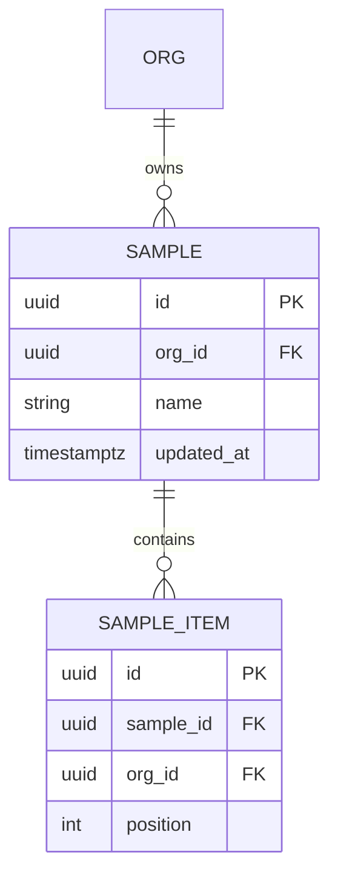

# vmodel-design — アーキテクチャ・データフロー・ドメインモデル・詳細設計

V字の左下。**すべての設計項目は、それが満たす `REQ-*` を明記する。** 対応する要件が無い設計項目は、要件を書き忘れているか、その設計が不要かのどちらか。

既存のアーキテクチャ・レイヤ構成・命名を先に読む。**新しい流儀を持ち込まない。**

## `03-architecture.md` — `ARC-*`

構成要素と依存の向きを決める。判断には必ず理由と、却下した案を書く。

````markdown
### [ARC-002] 複製はサービス層のトランザクション内で完結させる

- 満たす要件: REQ-F-001, REQ-N-002, REQ-N-004
- 決定: 複製処理は単一トランザクション内で、親と全子要素を書き込む
- 理由: REQ-N-004（原子性）を満たすには、部分コミットの余地を無くす必要がある
- 却下案: 親を先に作り子を非同期投入 → 中断時に孤児レコードが残り REQ-N-004 を破る
- 影響: 子要素が数千件規模になると REQ-N-002 の 300ms を割る可能性。上限を設けるか要確認

### コンポーネント構成



依存の向き: UI → API → サービス → リポジトリ → DB。**逆流させない。**
````

### 影響範囲と従属関係（必須章。省略しない）

**触る関数の呼び出し元を全部洗ってから設計する。** 一箇所だけ直して兄弟の呼び出し元を壊す事故は、この章を飛ばしたときにだけ起きる。

```bash
# 変更・利用する関数／型／テーブルごとに、逆方向の依存を洗う
grep -rn 'copySample' src tests
grep -rn 'from .*sample/copy' src
grep -rn 'sample_item' src apps/db   # スキーマを触るなら参照箇所も
```

洗った結果を表にする。**推測で埋めず、grep の実結果だけを書く。**

| 変更対象 | 種別 | 呼び出し元・依存元 | 影響 | 既存テスト | 対応 |
|---------|------|-----------------|------|----------|------|
| `copySample` | 新規 | なし | — | — | 新規 UT-011〜013 |
| `sampleRepo.findById` | シグネチャ変更 | `copy.ts`, `detail.ts`, `export.ts` | 3箇所すべて要修正 | `detail.test.ts` | 回帰確認 |
| `sample_item.org_id` | カラム追加 | 挿入3箇所、参照5箇所 | 既存行のバックフィルが必要 | `IT-004` | マイグレーション + IT-004 拡張 |

- **共有関数を直すときは、呼び出し元ごとに個別対処せず、共有側で1回直す。** 呼び出し元にガードを配ると、次の呼び出し元が追加されたときに再発する。
- 影響が要件外まで及ぶ場合は、そこで止めてスコープをユーザーに確認する。勝手に広げない。
- この表の「既存テスト」列は、そのまま `07-test-plan.md` の回帰テスト範囲になる。

### 結合度の評価（必須章）

新しく作る／変更する境界ごとに、結合の強さを判定する。

| 境界 | 依存の向き | 結合の種類 | 判定 | 根拠 |
|------|----------|----------|------|------|
| サービス → リポジトリ | 単方向 | 引数と戻り値のみ | 疎 | DB の型を外に漏らしていない |
| UI → サービス | 単方向 | HTTP 越し | 疎 | — |
| 複製サービス → 実行履歴 | 単方向 | ID 参照のみ | 疎 | 集約をまたいで実体を引かない |

**次のどれかに当たったら密結合として設計をやり直す:**

- 双方向依存・循環依存がある
- 下位レイヤが上位レイヤの型や概念を知っている（リポジトリが画面の都合を知っている等）
- 片方の内部データ構造にもう片方が直接触っている
- 一方を変えるともう一方のテストが必ず落ちる
- 集約の外側の実体を、ID ではなくオブジェクトとして直接保持している

ただし**疎結合のために抽象を増やさない。** 実装が1つしかないインターフェース、変わらない値のための設定、将来のための差し替え口は、結合を下げずにコードだけ増やす。実際に2つ目の実装が必要になってから足す。

## `04-dataflow.md` — `DFD-*`

**正常系と異常系を別々の図にする。** 正常系だけの図は、下流の異常系テストの根拠にならない。

````markdown
### [DFD-004] サンプル複製（正常系）

満たす要件: REQ-F-001



### [DFD-005] サンプル複製（異常系）

満たす要件: REQ-F-001 の異常系, REQ-N-003, REQ-N-004


````

**認可はトランザクション内で再検証する。** 呼び出し前のチェックだけでは、チェックから書き込みまでの間に権限が変わる。図にもその順序を書く。

## `05-domain-model.md` — `ENT-*` と DDD

### ユビキタス言語

| 用語 | 定義 | コード上の名前 | 使わない言い方 |
|------|------|--------------|--------------|
| サンプル | 組織が所有する再利用可能なテンプレート | `Sample` | テンプレ、雛形 |
| 複製 | サンプルと全子要素の新規コピー生成 | `copySample` | コピー、クローン |

**ここで決めた名前を、実装・テスト・画面文言すべてで使う。** 揺れると `review-naming-structure` が指摘する。

### 境界づけられたコンテキスト

各コンテキストの責務、外部に公開するもの、他コンテキストとの関係（腐敗防止層の要否）を書く。

### 集約と不変条件

````markdown
### [ENT-002] サンプル（集約ルート）

- 識別子: `SampleId`
- 所有者: 組織（`OrgId`）。**組織をまたいで参照しない**
- 集約に含む: サンプル本体、サンプル項目（`ENT-003`）
- 集約に含まない: 実行履歴（別集約。ID 参照のみ）

不変条件（**破れたら永続化してはならない**）:
| ID | 不変条件 | 破れたときの検証先 |
|----|---------|-----------------|
| INV-001 | `name` は組織内で1〜120字 | UT-011 |
| INV-002 | 子項目は必ず同じ `orgId` を持つ | UT-013, IT-004 |
| INV-003 | 親のない子項目は存在しない | IT-006 |


````

**不変条件は必ず ID を持ち、それを検証するテストに紐づける。** 不変条件は mutation テストで最初に狙われる場所であり、テストが無いと確実に生存 mutant になる。

## `06-detailed-design.md` — `DES-*`

モジュール／関数単位。**シグネチャ・事前条件・事後条件・エラーの種類**を書く。実装本体は書かない。

```markdown
### [DES-011] copySample

- 満たす要件: REQ-F-001, REQ-N-002, REQ-N-004
- 実装先: `src/lib/sample/copy.ts`
- シグネチャ: `copySample(tx, actor: Actor, id: SampleId): Result<Sample, CopyError>`
- 事前条件: `tx` はトランザクション内。`actor` は認証済み
- 事後条件: 成功時、親1件と子 n 件が同一 `orgId` で作成される。元は不変
- エラー:
  | 種類 | 発生条件 | 呼び出し元の扱い |
  |------|---------|----------------|
  | `NotFound` | 対象が存在しない、または actor の組織外 | 404。存在を示唆しない |
  | `NameConflict` | 連番を付けても上限に達した | 409 |
  | `Aborted` | 子の書き込み失敗 | 500。ロールバック済み |
- 呼び出す: DES-012（リポジトリ）
- 境界値: 子要素 0件 / 1件 / 上限件数 / 名前 120字 / 121字
```

**境界値を設計時に列挙する。** ここに書いた値がそのまま `07-test-plan.md` の異常系・境界値ケースになる。

## 完了条件

- すべての `ARC-*` / `DFD-*` / `ENT-*` / `DES-*` が、満たす `REQ-*` を明記している
- **影響範囲の表が grep の実結果で埋まっており、既存テスト列がある**
- **結合度の表があり、密結合の判定に当たる境界が残っていない**
- 異常系のデータフロー図が正常系とは別にある
- 集約ごとに不変条件が ID 付きで列挙され、検証先が指定されている
- すべての `DES-*` にエラー種別と境界値がある
- 台帳の `設計` 列が埋まっている

## Red Flags

- 設計項目に対応する `REQ-*` が無い → 要件漏れか、不要な設計
- 影響範囲を grep で洗わずに「たぶん影響なし」と書いた → 洗うまで進まない
- 共有関数の呼び出し元ごとに個別のガードを足す設計になっている → 共有側で1回直す
- 疎結合を理由に、実装が1つしかないインターフェースを足した → 結合は下がらずコードだけ増える。やめる
- データフロー図が正常系だけ → 異常系の図を追加するまで完了にしない
- 認可チェックが書き込みトランザクションの外にある → 中で再検証する形に直す
- 不変条件が散文で書かれ ID が無い → テストに紐づけられない。表にする
- ユビキタス言語表を作らずに設計を書いた → 名前が実装で揺れる
- 既存のレイヤ構成と違う依存の向きを導入した → 既存に合わせるか、`ARC-*` として理由を明記する
