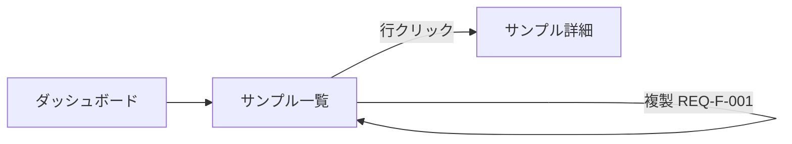

# vmodel-requirements — 画面仕様書と要件定義書

V字の左上。**ここで決めた ID が下流すべての参照先になる**ので、採番は `vmodel-trace` の規則に従う。

書く前に、既存の画面・API・スキーマを読む。**現状を読まずに要件を書くと、既にある挙動を「新規要件」として二重に作る。**
**既にチケットや設計文書に要件があるなら、それも読む。** コードだけから要件を書き起こすと、
既存要件と矛盾する要件を作り、どちらが正か分からなくなる。

## 成果物0: `00-user-stories.md`

**誰のために作るのかを先に決める。** これを飛ばすと、テストが「主操作者の正常系」だけになり、
権限違い・データの消費者・運用者の経路がまるごと落ちる。E2E の網羅性はここで決まる。

### 利用者の洗い出し（このチェックリストを1周する）

該当なしなら `N/A: 理由` を1行書く。**章ごと落とさない。**

| 類型 | 問い | 落としたときに起きること |
|------|------|--------------------|
| 主操作者 | この機能を毎日使うのは誰か | — |
| 権限違いの同僚 | 一段弱い権限（member / viewer / 未所属）だと何が変わるか | 権限テストが1ユーザーで代表され、境界が未検証になる |
| 別テナントの他人 | 到達してはいけない人は誰か | 組織横断の遮断が未検証のまま出る |
| **データの消費者** | 溜めたデータを後で読むのは誰か。何を知りたいのか | 書き込みだけテストされ、**集計が成立しないことに誰も気づかない** |
| **運用者** | 障害対応・削除請求・退会処理をする人は何を必要とするか | 個人データの所在や復旧手順が誰にも見えない形で出荷される |
| 誤操作する人 | 連打・ブラウザバック・リロード・並行タブで何が壊れるか | 二重実行が本番で初めて見つかる |
| 使えなくなる人 | キーボードのみ・小画面・低速回線で成立するか | アクセシビリティが後付けになる |

### 書き方

```markdown
### [US-001] 組織メンバーが公式サンプルをコピーして使い始める

- 役割: 組織メンバー（プロジェクト未所属でもよい）
- したいこと: 公式サンプルをコピーして、自分のプロジェクトとして開く
- なぜ: ゼロから作らずに動くものから始めたい
- 受け入れ条件:
  - [ ] 一覧からサンプルを選んでコピーでき、作成されたプロジェクトへ遷移する
  - [ ] 失敗したときは何が起きたか分かり、中途半端なプロジェクトが残らない
- 対応する要件: REQ-F-001, REQ-F-003
- 検証: E2E-001（主導線）, E2E-002（異常系）
```

- ID は `US-nnn`。**役割・目的・理由・受け入れ条件・対応要件**を必ず持つ
- **1つの US に複数の役割を詰めない。** 役割が違えば別の US。権限の境界がそこにある
- 「〜できること」ではなく**利用者が達成したいこと**を書く。手段は要件と設計が決める

## 完了条件（ユーザーストーリー）

- 上のチェックリスト7類型が、US または `N/A: 理由` で埋まっている
- すべての `REQ-F-*` が、上流に最低1つの `US-*` を持つ
- すべての `US-*` が受け入れ条件と検証手段（`E2E-*` / `QA-*` / `N/A: 理由`）を持つ

## 成果物1: `01-screen-spec.md`

画面ごとに1章。**画面項目 ↔ データ項目の対応表を省略しない** — これが「画面とデータのリンク」を追える唯一の場所。

````markdown
## [SCR-002] サンプル一覧画面

- URL: `/samples`
- 権限: 組織メンバー以上
- 到達経路: ダッシュボード → サンプル

### 画面項目 ↔ データ

| 項目ID | 画面上の名称 | 種別 | データ源 | 必須 | 制約・書式 | 空のとき |
|--------|-------------|------|---------|------|-----------|---------|
| SCR-002-F01 | 検索ボックス | 入力 | クエリパラメータ `q` | 任意 | 100字以内 | 全件表示 |
| SCR-002-F02 | サンプル名 | 表示 | `ENT-002.name` | — | 1〜120字 | — |
| SCR-002-F03 | 更新日時 | 表示 | `ENT-002.updatedAt` | — | `YYYY/MM/DD HH:mm` ローカル時刻 | `—` |
| SCR-002-F04 | 複製ボタン | 操作 | `REQ-F-001` を起動 | — | 権限が無い場合は非活性 | — |

### 状態

| 状態 | 条件 | 表示 |
|------|------|------|
| 初期 | 読み込み中 | スケルトン |
| 空 | 0件 | 空状態メッセージ＋作成導線 |
| エラー | 取得失敗 | 再試行ボタン。**空状態と区別する** |
| 権限なし | 組織外 | 404 相当。存在を漏らさない |

### 画面遷移


````

**取得失敗と0件を必ず別の状態にする。** 一つにまとめると、権限エラーやネットワーク断が「データが無い」と表示され、ユーザーが誤った判断をする。

## 成果物2: `02-requirements.md`

機能要件と非機能要件を**別の章に置く**。同じ表に混ぜない。判定基準も検証手段も違うため、混ぜると非機能が必ず抜ける。

### 章1: 機能要件

```markdown
### [REQ-F-001] サンプルを複製できる

- 上流: SCR-002-F04
- 利用者: 組織メンバー
- 事前条件: 対象サンプルが同一組織に属し、閲覧権限がある
- 主フロー: 複製ボタン押下 → 確認 → 複製実行 → 一覧に「〇〇のコピー」が先頭で表示される
- 事後条件: 元サンプルは変更されない。複製は元の子要素をすべて含む
- 受け入れ基準:
  - [ ] 複製後、一覧に新しい行が1件増える
  - [ ] 複製名は `<元の名前>のコピー`。同名が既にある場合は連番を付ける
  - [ ] 元サンプルの `updatedAt` は変わらない
- 異常系:
  - 対象が他組織 → 404 相当。存在を示唆しない
  - 権限なし → ボタン非活性、API も 403
  - 複製途中で失敗 → 部分的な複製を残さない（全体をロールバック）
  - 同時に2回押下 → 複製は1件だけ
```

**異常系を「エラーを表示する」で済ませない。** どのエラーで、何をユーザーに見せ、データがどうなるかまで書く。ここが薄いと、下流の異常系テストが書けず mutation で必ず生存 mutant が出る。

### 章2: 非機能要件

すべての `REQ-N-*` に **目標値・測定方法・検証手段** を持たせる。この3つが無い非機能要件は検証できず、台帳の下流列が永久に埋まらない。

```markdown
| ID | 分類 | 要件 | 目標値 | 測定方法 | 検証手段 |
|----|------|------|--------|---------|---------|
| REQ-N-001 | 性能効率性 | 一覧の初期表示 | p95 < 800ms（100件時） | 本番相当データでの計測 | IT-009 |
| REQ-N-002 | 性能効率性 | 複製処理 | p95 < 300ms | 同上 | IT-009 |
| REQ-N-003 | セキュリティ | 組織横断アクセスの遮断 | 他組織リソースへの到達 0件 | 権限マトリクス総当たり | IT-004, IT-005 |
| REQ-N-004 | 信頼性 | 複製の原子性 | 部分書き込み 0件 | 中断注入 | IT-006 |
| REQ-N-005 | 使用性 | キーボード操作 | 全操作がキーボードで到達可能 | 手動QA | QA-003 |
| REQ-N-006 | 保守性 | 変更ファイルの mutation スコア | 生存 mutant について対処済み | Stryker | Phase 5 |
| REQ-N-007 | 法令・規制 | 個人情報のログ出力 | ログに氏名・メールを出さない | ログ検査 | IT-007 |
| REQ-N-008 | 可観測性 | 複製失敗の検知 | 失敗時に構造化ログとメトリクス | ログ確認 | IT-008 |
```

**分類は最低限この観点を1周する**（該当なしなら `N/A: 理由` を1行書く。章ごと落とさない）:
性能効率性 / 信頼性 / セキュリティ / 使用性・アクセシビリティ / 保守性 / 移植性 / 可観測性・運用性 / 法令・規制

## 完了条件

- すべての `SCR-*` 項目が、データ源またはトリガーする `REQ-F-*` を持つ
- すべての `REQ-F-*` が受け入れ基準と異常系を持つ
- すべての `REQ-N-*` が目標値・測定方法・検証手段を持つ
- 台帳 `00-traceability.md` に全要件行がある（下流列は `未`）
- 非機能の8観点が、要件か `N/A: 理由` のどちらかで埋まっている

## Red Flags

- 機能要件の表に「レスポンスは速いこと」が混ざっている → 非機能の章へ移す
- 非機能要件に目標値が無い（「十分に速い」「安全であること」） → 測れないので要件ではない。数値か判定手順にする
- 異常系が「エラーを表示」だけ → データがどうなるかを書く
- 画面項目表にデータ源の列が無い → 画面とデータのリンクが切れる。書くまで進まない
- 既存実装を読まずに要件を書き始めた → 現状を読む
